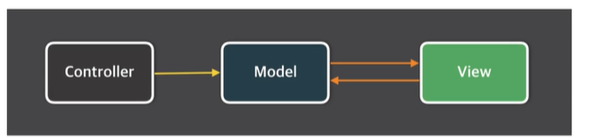
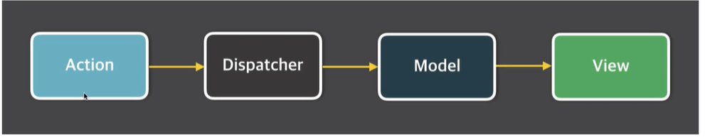
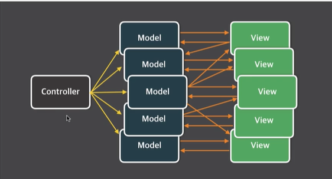
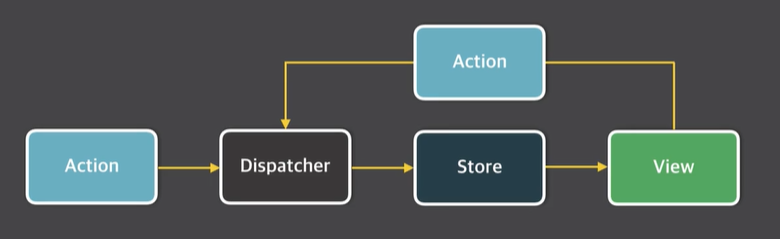
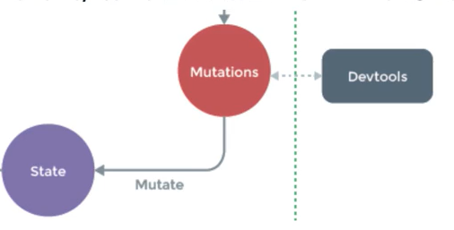

# Vuex
리액트의 Flux 패턴에서 기인한 상태관리 라이브러리

MVC 패턴이란?

Flux 란?

MVC 패턴의 복잡한 데이터 흐름 문제를 해결하는 개발 패턴
1. action : 화면에서 발생하는 이벤트 또는 사용자의 입력
2. dispatcher : 데이터를 변경하는 방법, 메서드
3. model : 화면에 표시할 데이터
4. view : 사용자에게 비춰지는 화면

## MVC 패턴의 문제점

- 기능 추가 및 변경에 따라 생기는 문제점을 예측할 수가 없음
- 앱이 복잡해지면서 생기는 업데이트 루프

## Flux 패턴의 단방향 데이터 흐름
데이터의 흐름이 여러 갈래로 나뉘지 않고 단방향으로만 처리

## Vuex 컨셉
- State : 컴포넌트 간에 공유하는 데이터 data()
- View  : 데이터를 표시하는 화면 template
- Action: 사용자의 입력에 따라 데이터를 변경하는 methods

## Vuex 구조
컴포넌트 -> 비동기로직 -> 동기로직 -> 상태

## Vuex 기술 요소
- state : 여러 컴포넌트에 공유되는 데이터 data
- getters : 연산된 state 값을 접근하는 속성 computed
- mutations : state 값을 변경하는 이벤트 로직, 메서드 methods
- actions : 비동기 처리 로직을 선언하는 메서드 async methods

### mutations란?
- state의 값을 변경할 수 있는 유일한 방법이자 메서드
- 뮤테이션은 commit()으로 동작시킨다
- 동기처리 로직만 넣어야 한다.

### 왜 mutations로 state를 변경해야 하는가??
- 여러 컴포넌트에서 state를 직접 변경하면 어디서 변경했는지 추적하기 어렵다
- 특정 시점에 어떤 컴포넌트가 state에 접근하여 변경한 거지 확인하기 어렵기 때문
- 뷰의 반응성을 거스르지 않게 명시적으로 상태 변화를 수행. 반응성, 디버깅, 테스팅 혜택

## actions란?
- 비동기 처리 로직을 선언하는 메서드. 비동기 로직을 담당하는 mutations
- 데이터 요청, promise, es6 async와 같은 비동기 처리는 모두 actions에 선언한다.
