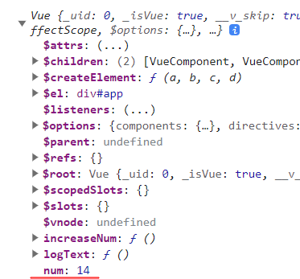

## Reactivity
요소의 변경을 추적하고 요소를 자동으로 변형 시키는 프로그래밍 기법
요소가 변경되면 변경에 반응하여 DOM이나 JS 코드를 변형시킬 수 있다.  
데이터 변화가 발생했을 시에 DOM 을 자동으로 변경해주거나 반대로 DOM이 조작 됐을 때 JAVASCRIPT의 코드가 변경되는 등 
연결 시켜준 요소들을 변형시키는 방법이다.

Vue의 핵심은 데이터의 변화를 라이브러리에서 감지해서 화면을 자동으로 변경시켜주는 역할을 한다. 
javascript 만으로 데이터 바인딩을 해보면 아래와 같이 할 수 있다.

    <body>
        

    </body>
    

## Vue에서의 this

객체 내부에서 this를 찍으면 상위스코프인 인스턴스나 객체 리터럴 자신을 가리키는 것과 같이 Vue 내부에서의 this도 Vue 객체를 가리킨다.

    const obj = {
         num: 10,
         log: function () {
             console.log(this.num)
         }
    }
    obj.log() // 10

Vue의 경우 this를 사용하여 data 안에 있는 요소에 접근하려면 <code>this.data.num</code> 으로 접근 해야할거 같지만
<code>this.num</code> 으로 접근 가능하다

    new Vue({
        data: {
          num: 10
        },
        methods: {     
            increaseNum: function () {
                this.num++
            },
        }
    })

data안에 프로퍼티를 선언하더라도 Vue의 프로퍼티로 올려진 상태로 저장이 되기 때문이다

